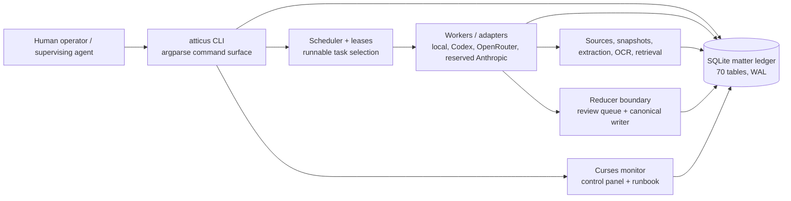
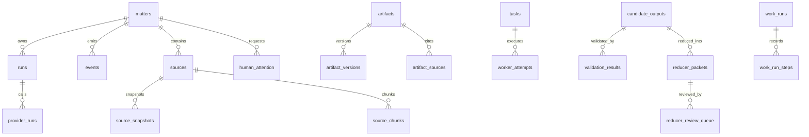
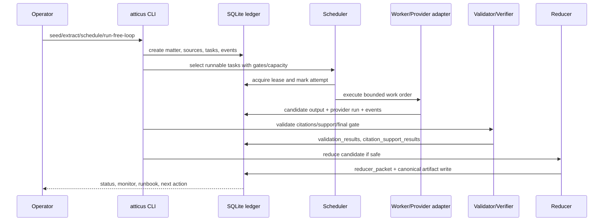

# Atticus Harness V1 Architecture Research Paper

**Date:** 2026-05-06  
**Reference codebase analysed:** `/home/alba/atticus-harness` — Python 3.11 package `atticus-harness`.

---

## Abstract

Atticus Harness V1 is a Python, SQLite-centred legal operations control plane. Its architecture optimises for durable legal governance: a normalized matter ledger, explicit model-routing policy, deterministic scheduling, lease-governed work execution, reducer-only canonical writes, and deep operational repair and monitoring tooling.

The V1 centre of gravity is the database ledger and policy boundary. Model outputs are treated as untrusted candidate material until they are traced to evidence, validated, reviewed, reduced, and written through canonical reducers.

---

## 1. Research methodology

This paper is based on static source inspection of the V1 codebase, with emphasis on architecture-significant files.

| Topic | V1 evidence |
| --- | --- |
| Runtime/package | `pyproject.toml`, `atticus/cli.py` |
| Durable model | `atticus/db/schema.py`, `atticus/db/repo.py` |
| Agent/orchestration | `atticus/agents/*`, `atticus/scheduler/*`, `atticus/workers/*` |
| Evidence/research | `atticus/evidence_ingest/*`, `atticus/retrieval/*`, `atticus/graph/*` |
| Safety/gates | `atticus/reducer/*`, `atticus/validation/*`, `atticus/providers/*` |
| Operator surface | `README.md`, `atticus/monitor/*`, `operator_control.py` |

| Metric | V1 |
| --- | ---: |
| Primary language | Python 3.11 |
| Top-level implementation modules | 24 Python package areas under `atticus/` |
| Durable schema tables observed | 70 SQLite tables |
| CLI command registrations observed | 72 argparse subcommands |
| Unit/integration tests observed | 68 Python test files |
| Skills library | small curated package in repo |

---

## 2. Architectural thesis

V1 is a legal control plane. It assumes the ledger is the source of truth, model outputs are untrusted candidates, reducers write canonical artifacts, task execution is lease-governed, and provider policy must be deterministic and fail closed.

Its strongest architectural invariant is that legal model output is not legal truth until it has passed evidence, validation, reducer, and operator-safe policy boundaries.

---

## 3. Architecture

### 3.1 V1 system context

V1 is installed as a Python package named `atticus-harness` and exposes `atticus = atticus.cli:main`. It has no runtime dependencies in `pyproject.toml` outside the standard library, with `pytest` as a development extra. This makes the core harness highly portable and testable.

### 3.2 Module decomposition

| V1 module area | Architectural responsibility |
| --- | --- |
| `atticus/cli.py`, `atticus/commands/` | A broad operator command surface with setup, health, validation, scheduling, live loop, reducers, model policy, migration, and human-attention workflows. |
| `atticus/db/`, `atticus/core/` | SQLite schema, repository functions, matter identity, policies, permissions, event emission, tasks, runs, and safety state. |
| `atticus/graph/` | Legal graph primitives: sources, snapshots, artifacts, dependencies, evidence, certifications, staleness. |
| `atticus/evidence_ingest/`, `atticus/extraction/` | Multi-stage evidence ingestion, local extraction, OCR repair, registration, provenance, and validation. |
| `atticus/context/` | Deterministic context packs, sectioning, token budgeting, compression records, cache observability. |
| `atticus/scheduler/` | Dependency-aware runnable-task selection, capacity planning, leases, gates, supervisor/free loop, live resume. |
| `atticus/providers/`, `atticus/adapters/` | Provider runtime abstraction, OpenRouter/Codex/live readiness, deterministic routing, cost/budget, failover policy. |
| `atticus/agents/`, `atticus/workers/` | Coordinator/orchestrator/subagent logic, work-order building, worker runtime, repair planners/executors. |
| `atticus/reducer/`, `atticus/validation/`, `atticus/verifier.py` | Candidate validation, citation support, reducer packets, review queue, council/dissent, canonical writer. |
| `atticus/monitor/`, `operator_control.py`, `status/` | TUI monitoring, next-action calculation, completion snapshots, runbooks, human attention cleanup. |
| `atticus/migration*`, `atticus/work_runs.py`, `atticus/memory/`, `atticus/memdir/` | Migration, resumability, reuse records, operational memory and session state. |

### 3.3 V1 data architecture

V1's SQLite schema is the system's principal architecture document. The schema contains 70 observed tables grouped around legal matter state, graph records, tasks, validation, provider telemetry, work runs, human attention, repair, and migration.

The central design choice is **ledger-first governance**. Almost every important operation is represented in SQLite, which supports:

- replayability and migration through `schema_meta` / schema versioning;
- fine-grained diagnosis through event/error/provider/attention tables;
- matter isolation by `matter_scope` foreign keys;
- normalized artifact/source/citation relationships;
- terminal-state tracking for tasks, worker attempts, validation, reducers, and final gates.

### 3.4 V1 execution lifecycle

### 3.5 V1 safety doctrine

V1 encodes a strong legal-safety posture:

- **Candidate-first output.** Workers produce candidate packets, not canonical legal documents.
- **Reducer-only canonical writes.** The reducer layer is the canonical artifact boundary.
- **Evidence before argument.** Sources, snapshots, extraction records, and citation support tables precede accepted legal conclusions.
- **Fail-closed routing.** Provider policy requires explicit routes; silent fallback is rejected.
- **Human attention is first-class.** Blocks, attention records, operator responses, and runbooks are explicit persistent objects.
- **Loop guards.** Leases, capacity, no-silent-idle checks, blocked reasons, and repair plans prevent infinite blind reruns.

### 3.6 V1 strengths

1. **Strong governance and auditability.** V1's schema makes legal provenance and operator accountability inspectable.
2. **Operational recoverability.** Repair plans, completion snapshots, runbooks, work-run reuse, and migration reports provide durable recovery paths.
3. **Explicit model policy.** Smart routing separates flash/pro/Codex/reserved Anthropic profiles and blocks unsafe or unknown routes.
4. **Mature monitor/control tooling.** The curses monitor and operator control panel treat supervision as a product feature.
5. **Low dependency risk.** The core Python package has minimal runtime dependencies.

### 3.7 V1 weaknesses / trade-offs

1. **High cognitive load.** The broad CLI and 70-table schema demand expert operation.
2. **Product ergonomics lag.** V1 is powerful but less approachable as a day-to-day legal agent shell.
3. **Implementation sprawl.** Numerous subsystem-specific commands make the architecture robust but harder to onboard.
4. **Provider/tool loop less productised.** V1 has adapters and workers, but its provider/tool loop is less packaged as a day-to-day agent UX.

---

---

## 4. Conclusion

V1 is conservative, normalized, and governance-heavy. Its operational complexity is real, but it captures legal provenance, task execution, model routing, validation, reducer decisions, and operator attention as inspectable durable state. It remains the reference safety architecture for stronger governance patterns.

---

## Appendix B: Glossary

- **Candidate artifact:** A draft/model-produced output that is not yet canonical.
- **Canonical artifact:** An accepted matter artifact that passed policy and review boundaries.
- **Reducer:** A safety layer that converts or rejects candidate packets before canonical writing.
- **Matter:** A legal case/workspace with scoped evidence, state, events, and artifacts.
- **Prepare-only external action:** A letter/form/filing/email candidate prepared for operator review but not sent, filed, served, paid, or otherwise externally executed by the harness.
- **Source snapshot:** Stored copy/hash/text of a source used to make verification reproducible.
