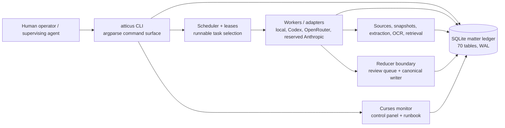
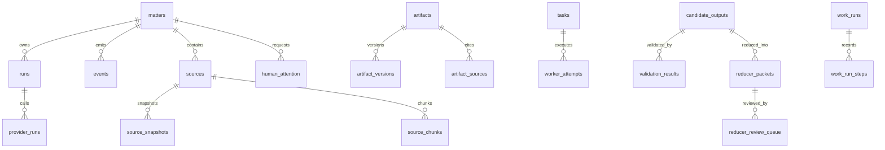
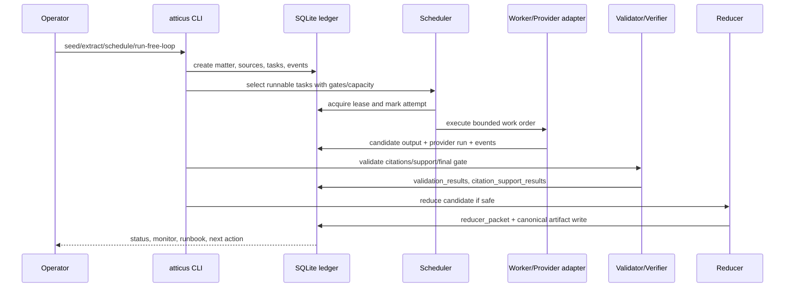
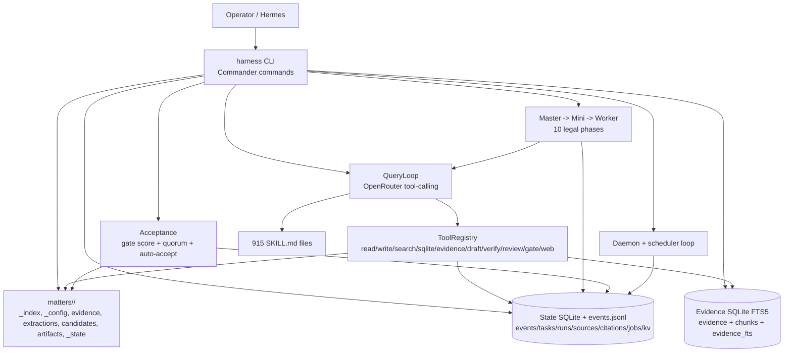
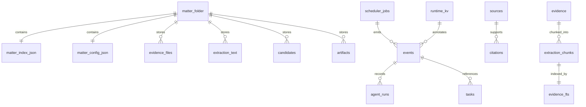
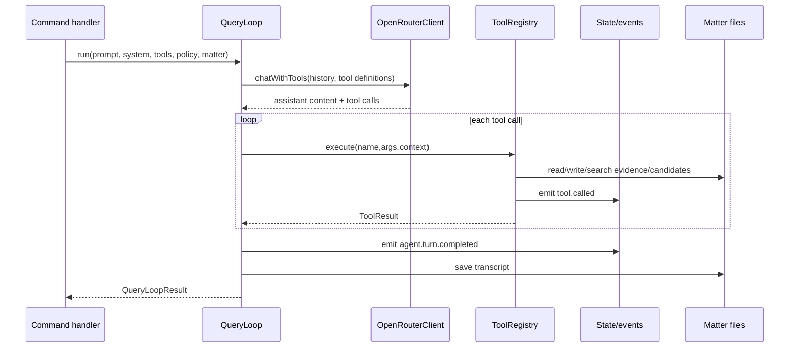
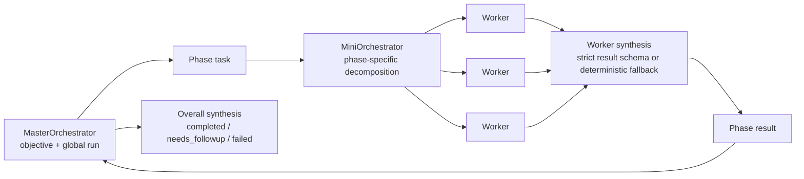
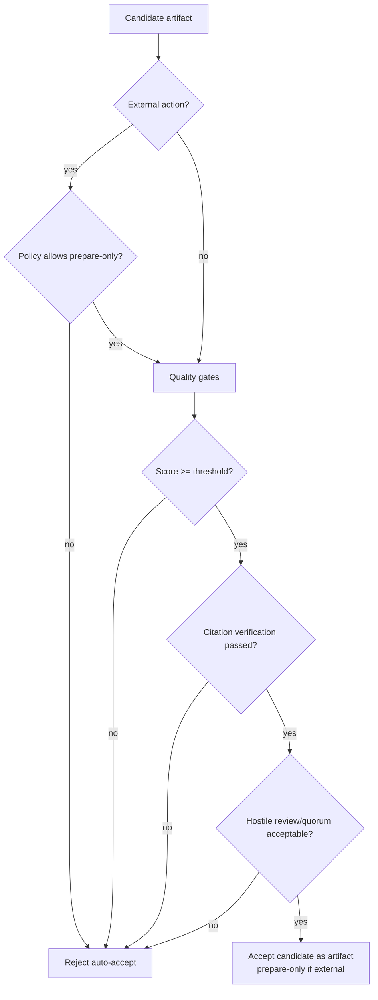
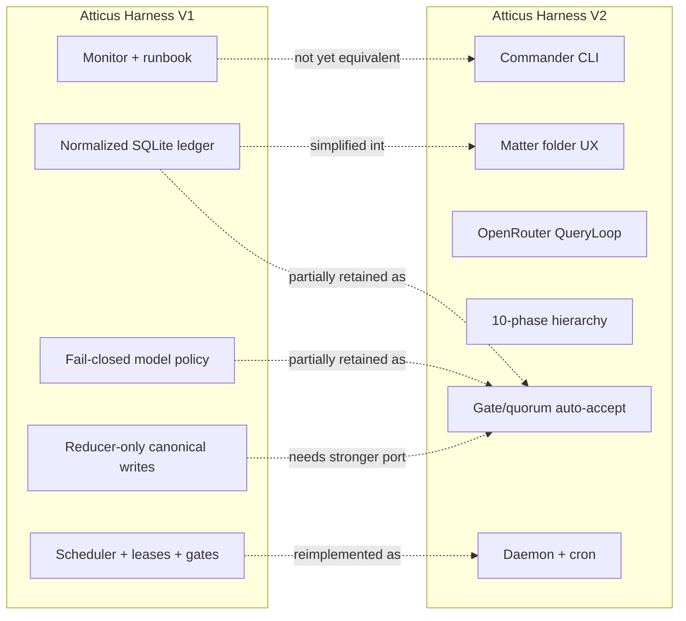
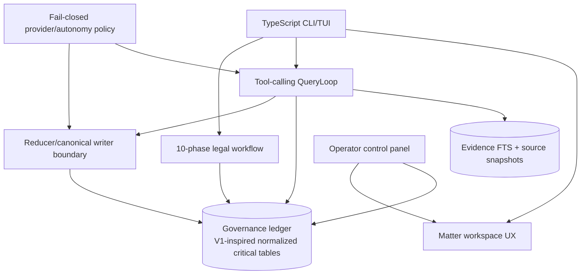

# Atticus Harness V1 and V2: Comparative Architecture Research Paper

**Date:** 2026-05-06  
**Repository under update:** `atticus-harness-v2`  
**Reference codebases analysed:**

- **V1:** `/home/alba/atticus-harness` — Python 3.11 package `atticus-harness`.
- **V2:** `/home/alba/atticus-harness-v2` — TypeScript/Node CLI package `harness-v2`.

---

## Abstract

Atticus Harness has evolved from a Python, SQLite-centred legal operations control plane (V1) into a TypeScript, terminal-native legal agent CLI (V2). V1 optimises for durable legal governance: a large normalized ledger, explicit model-routing policy, deterministic scheduling, reducer-only canonical writes, and deep operational repair tooling. V2 optimises for product ergonomics and agent execution: a compact Commander CLI, matter-scoped filesystem layout, SQLite/JSONL dual audit state, OpenRouter tool-calling loops, hierarchical master/mini/worker orchestration, source snapshotting, quality gates, review quorum, and daemon/scheduler support.

The migration is not a linear rewrite. It is a change in architectural centre of gravity. V1's centre is the database ledger and policy boundary; V2's centre is the CLI-driven agent runtime and matter workspace. The safest future architecture should combine V2's simpler operator surface and TypeScript agent loop with selected V1 invariants: reducer-only canonical writes, richer task leases, explicit provider policy fail-closed semantics, migration discipline, and mature monitor/control-panel workflows.

---

## 1. Research Methodology

The analysis used static source inspection of both local codebases and focused on architecture-significant files rather than line-by-line implementation review.

### 1.1 Evidence base

| Topic | V1 evidence | V2 evidence |
| --- | --- | --- |
| Runtime/package | `pyproject.toml`, `atticus/cli.py` | `package.json`, `src/cli.ts` |
| Durable model | `atticus/db/schema.py`, `atticus/db/repo.py` | `src/state/schema.ts`, `src/state/store.ts`, `src/storage/sqlite/schema.ts` |
| Agent/orchestration | `atticus/agents/*`, `atticus/scheduler/*`, `atticus/workers/*` | `src/agent/query-loop.ts`, `src/orchestration/*` |
| Evidence/research | `atticus/evidence_ingest/*`, `atticus/retrieval/*`, `atticus/graph/*` | `src/extraction/*`, `src/storage/sqlite/*`, `src/research/*` |
| Safety/gates | `atticus/reducer/*`, `atticus/validation/*`, `atticus/providers/*` | `src/acceptance/*`, `src/citation/verify.ts`, `src/config/*` |
| Operator surface | V1 `README.md`, `atticus/monitor/*`, `operator_control.py` | V2 `README.md`, `docs/hermes-agent-guide.md`, `src/commands/*` |

### 1.2 Architectural scale indicators

| Metric | V1 | V2 |
| --- | ---: | ---: |
| Primary language | Python 3.11 | TypeScript / Node 18+ |
| Top-level implementation modules | 24 Python package areas under `atticus/` | 18 TypeScript source areas under `src/` |
| Durable schema tables observed | 70 SQLite tables | 8 matter-state tables + 4 evidence-index tables |
| CLI command registrations observed | 72 argparse subcommands | 55 Commander command/new-command registrations |
| Unit/integration tests observed | 68 Python test files | 21 Vitest files |
| Skills library | small curated package in repo | 915 bundled legal/writing skills |

---

## 2. Architectural Thesis

V1 and V2 solve overlapping but differently-weighted problems.

1. **V1 is a legal control plane.** It assumes the ledger is the source of truth, model outputs are untrusted candidates, reducers write canonical artifacts, task execution is lease-governed, and provider policy must be deterministic and fail closed.
2. **V2 is a legal agent product shell.** It assumes the operator will run a terminal CLI around matter folders, agent loops, tool registries, evidence search, source fetches, schedules, daemon control, and candidate acceptance.
3. **V2 intentionally narrows some V1 complexity.** It collapses V1's 70-table normalized legal graph into per-matter filesystem state plus a compact SQLite ledger. This accelerates usability but leaves fewer explicit invariants encoded in schema.
4. **The best V3 direction is synthesis rather than replacement.** V2 should keep its TypeScript execution model but port V1's strongest governance patterns where legal risk requires them.

---

## 3. V1 Architecture

### 3.1 V1 system context

V1 is installed as a Python package named `atticus-harness` and exposes `atticus = atticus.cli:main`. It has no runtime dependencies in `pyproject.toml` outside the standard library, with `pytest` as a development extra. This makes the core harness highly portable and testable.

### 3.2 Module decomposition

| V1 module area | Architectural responsibility |
| --- | --- |
| `atticus/cli.py`, `atticus/commands/` | A broad operator command surface with setup, health, validation, scheduling, live loop, reducers, model policy, migration, and human-attention workflows. |
| `atticus/db/`, `atticus/core/` | SQLite schema, repository functions, matter identity, policies, permissions, event emission, tasks, runs, and safety state. |
| `atticus/graph/` | Legal graph primitives: sources, snapshots, artifacts, dependencies, evidence, certifications, staleness. |
| `atticus/evidence_ingest/`, `atticus/extraction/` | Multi-stage evidence ingestion, local extraction, OCR repair, registration, provenance, and validation. |
| `atticus/context/` | Deterministic context packs, sectioning, token budgeting, compression records, cache observability. |
| `atticus/scheduler/` | Dependency-aware runnable-task selection, capacity planning, leases, gates, supervisor/free loop, live resume. |
| `atticus/providers/`, `atticus/adapters/` | Provider runtime abstraction, OpenRouter/Codex/live readiness, deterministic routing, cost/budget, failover policy. |
| `atticus/agents/`, `atticus/workers/` | Coordinator/orchestrator/subagent logic, work-order building, worker runtime, repair planners/executors. |
| `atticus/reducer/`, `atticus/validation/`, `atticus/verifier.py` | Candidate validation, citation support, reducer packets, review queue, council/dissent, canonical writer. |
| `atticus/monitor/`, `operator_control.py`, `status/` | TUI monitoring, next-action calculation, completion snapshots, runbooks, human attention cleanup. |
| `atticus/migration*`, `atticus/work_runs.py`, `atticus/memory/`, `atticus/memdir/` | Migration, resumability, reuse records, operational memory and session state. |

### 3.3 V1 data architecture

V1's SQLite schema is the system's principal architecture document. The schema contains 70 observed tables grouped around legal matter state, graph records, tasks, validation, provider telemetry, work runs, human attention, repair, and migration.

The central design choice is **ledger-first governance**. Almost every important operation is represented in SQLite, which supports:

- replayability and migration through `schema_meta` / schema versioning;
- fine-grained diagnosis through event/error/provider/attention tables;
- matter isolation by `matter_scope` foreign keys;
- normalized artifact/source/citation relationships;
- terminal-state tracking for tasks, worker attempts, validation, reducers, and final gates.

### 3.4 V1 execution lifecycle

### 3.5 V1 safety doctrine

V1 encodes a strong legal-safety posture:

- **Candidate-first output.** Workers produce candidate packets, not canonical legal documents.
- **Reducer-only canonical writes.** The reducer layer is the canonical artifact boundary.
- **Evidence before argument.** Sources, snapshots, extraction records, and citation support tables precede accepted legal conclusions.
- **Fail-closed routing.** Provider policy requires explicit routes; silent fallback is rejected.
- **Human attention is first-class.** Blocks, attention records, operator responses, and runbooks are explicit persistent objects.
- **Loop guards.** Leases, capacity, no-silent-idle checks, blocked reasons, and repair plans prevent infinite blind reruns.

### 3.6 V1 strengths

1. **Strong governance and auditability.** V1's schema makes legal provenance and operator accountability inspectable.
2. **Operational recoverability.** Repair plans, completion snapshots, runbooks, work-run reuse, and migration reports provide durable recovery paths.
3. **Explicit model policy.** Smart routing separates flash/pro/Codex/reserved Anthropic profiles and blocks unsafe or unknown routes.
4. **Mature monitor/control tooling.** The curses monitor and operator control panel treat supervision as a product feature.
5. **Low dependency risk.** The core Python package has minimal runtime dependencies.

### 3.7 V1 weaknesses / trade-offs

1. **High cognitive load.** The broad CLI and 70-table schema demand expert operation.
2. **Product ergonomics lag.** V1 is powerful but less approachable as a day-to-day legal agent shell.
3. **Implementation sprawl.** Numerous subsystem-specific commands make the architecture robust but harder to onboard.
4. **Provider/tool loop less productised.** V1 has adapters and workers, but V2's TypeScript tool-calling loop is easier to expose as an agent UX.

---

## 4. V2 Architecture

### 4.1 V2 system context

V2 is a Node/TypeScript CLI named `harness`. It runs as a standalone legal operations agent with evidence ingestion, hierarchical orchestration, drafting, citation verification, source snapshots, schedules, daemon control, and configurable autonomy.

### 4.2 Module decomposition

| V2 module area | Architectural responsibility |
| --- | --- |
| `src/cli.ts`, `src/commands/` | Commander CLI entry point and lazily-loaded command handlers for matter lifecycle, agent loops, evidence, acceptance, config, orchestration, sources, schedules, daemon, case management. |
| `src/storage/matter.ts`, `src/storage/*` | Matter workspace CRUD and artifact/candidate/evidence storage. Creates per-matter directories and `_index.json` / `_config.json`. |
| `src/state/*` | Matter state database and JSONL audit events: events, tasks, agent runs, sources, citations, scheduler jobs, runtime KV. |
| `src/storage/sqlite/*` | Evidence index with `evidence`, `extraction_chunks`, and FTS5 `evidence_fts` triggers. |
| `src/extraction/*` | Format detection, hashing, PDF/DOCX/DOC/image/text extraction and normalization. |
| `src/agent/*` | System prompt assembly, structured result parsing, transcript recording, QueryLoop over OpenRouter tool calls. |
| `src/tools/*`, `src/research/*` | Policy-aware agent tools plus web search/fetch/source normalization/ranking/snapshot storage. |
| `src/orchestration/*`, `src/legal/*` | Master/mini/worker orchestration over a 10-phase legal workflow and legal artifact taxonomy. |
| `src/acceptance/*`, `src/citation/verify.ts` | Quality gate scoring, review quorum, auto-acceptance rules, citation verification. |
| `src/config/*`, `src/llm/*` | Global/matter config, secrets, autonomy policy, provider policy, OpenRouter client, token counting. |
| `src/scheduler/*`, `src/daemon/*` | Cron parsing, scheduled job store/loop, daemon PID/status, background supervisor and control queue. |
| `src/tui/*` | Early Ink components for progress display; README currently states no full TUI/web UI. |
| `src/skills/*` and `skills/` | SKILL.md parsing/loading/selection with a large bundled legal skill corpus. |

### 4.3 V2 data architecture

V2 deliberately splits persistent state into three layers:

1. **Matter filesystem:** human-inspectable directories and JSON for matter index/config, evidence blobs, extractions, candidates, artifacts, state logs.
2. **Matter state SQLite:** a compact operational ledger for events, tasks, runs, sources, citations, scheduler jobs, runtime key-values, and schema version.
3. **Evidence SQLite:** searchable full-text index over evidence records and extraction chunks.

The architecture is more transparent to a filesystem user than V1, but it is less relationally complete. For example, V2 has a `citations` table and source store, but V1 has separate citation spans, citation support results, authority verification, artifact-source links, certifications, reducer packets, and final-gate states.

### 4.4 V2 agent/tool execution

The `QueryLoop` controls the core agent cycle:

1. construct a system/user message history;
2. call `OpenRouterClient.chatWithTools` with registered tool definitions;
3. execute requested tools through `ToolRegistry`;
4. append tool results into the message history;
5. emit `agent.turn.completed` and `tool.called` events;
6. save transcripts under matter candidates.

### 4.5 V2 hierarchical orchestration

The orchestrator expresses legal work as a 10-phase pipeline:

1. intake and normalization;
2. evidence ingestion and fact extraction;
3. issue spotting;
4. law and policy research;
5. merits and risk analysis;
6. procedural route planning;
7. document production;
8. verification and hostile review;
9. bundle and war-room assembly;
10. operator handoff.

`OrchestrationRuntime` enforces maximum depth, maximum concurrency, abort state, and optional budget limits. `worker-synthesis.ts` converts worker transcripts into a strict structured result, falling back deterministically if LLM synthesis fails. This is a pragmatic safety feature: worker output remains consumable even when model JSON generation is imperfect.

### 4.6 V2 autonomy and acceptance

V2 externalizes safety into configuration:

- autonomy modes: `operator_safe`, `auto_internal`, `auto_accept_gated`, `full_local_autonomy`, `custom`;
- external action modes: disabled, prepare-only, prepare-bundle-only, or operator-required-to-send;
- per-tool category policy: read-only, matter-write, network, external-action, agent-spawn, config-change;
- auto-accept conditions: gate score, citation verification, hostile review, review quorum, external-action checks.

### 4.7 V2 strengths

1. **Clean operator UX.** The `harness` CLI is coherent and grouped around real operator tasks.
2. **Simple matter layout.** Per-matter directories are easy to inspect, back up, and reason about.
3. **Modern agent loop.** The TypeScript OpenRouter tool-calling loop is direct, testable, and extensible.
4. **Integrated legal workflow.** The 10-phase workflow gives the orchestrator a domain-specific backbone.
5. **Large skill corpus.** The bundled skills turn the harness into a practical legal drafting/review environment.
6. **Daemon and scheduler support.** V2 can run asynchronously while still exposing status/events.
7. **Dual audit path.** SQLite plus JSONL events balance queryability and human-readable logs.

### 4.8 V2 weaknesses / trade-offs

1. **Reduced relational guarantees.** V2 has fewer normalized tables than V1; some legal invariants are enforced in code rather than schema.
2. **Canonical-write boundary is less explicit.** V2 has candidates and artifacts, but V1's reducer-only doctrine is stronger and more visible.
3. **Provider policy is simpler.** V2 has provider defaults and autonomy policy, but V1's fail-closed model routing is more mature.
4. **TUI/control maturity is behind V1.** V2 has progress components and daemon status, but no full monitor equivalent yet.
5. **Migration discipline is thinner.** State/evidence schema versioning exists, but V1 has broader migration/report infrastructure.

---

## 5. Comparative Analysis

### 5.1 Design comparison

| Dimension | V1 | V2 | Assessment |
| --- | --- | --- | --- |
| Architectural centre | SQLite ledger and policy boundary | CLI + agent runtime + matter folders | V2 is easier to use; V1 is more governable. |
| Runtime | Python stdlib-first | TypeScript/Node with `better-sqlite3`, Commander, Ink, React, OpenRouter stack | V2 aligns with modern agent tool-calling and TUI ambitions. |
| State model | 70-table normalized matter ledger | Filesystem + compact SQLite + JSONL + FTS5 | V2 is simpler; V1 captures more legal provenance. |
| Agent execution | Workers/adapters/scheduler/free loop | QueryLoop with OpenRouter tool calls | V2 is clearer for LLM tool integration. |
| Orchestration | Coordinator, scheduler, repair-oriented orchestrator | Master → mini → worker over 10 phases | V2 has a stronger domain workflow narrative. |
| Safety boundary | Reducer-only canonical writes; explicit validation tables | Configurable acceptance gates and prepare-only external mode | V1 boundary should be ported/strengthened in V2. |
| Provider routing | Smart profiles, pools, fail-closed, no silent fallback | OpenRouter defaults and provider policy | V1 is stronger for legal/audit risk. |
| Operator monitoring | Curses TUI, control panel, runbook, human attention | CLI status/events/watch, daemon status, Hermes guide | V2 should recover V1 monitor/control concepts. |
| Development ergonomics | Many commands/subsystems; strong tests | Smaller, readable TS modules; Vitest coverage | V2 is easier to extend for agent-product work. |

### 5.2 Evolution map

### 5.3 Key architectural finding

The most important architectural risk in V2 is that legal safety is more implicit. V1 put legal safety in relational records and lifecycle boundaries. V2 often puts safety in TypeScript control flow and configuration. That is not inherently unsafe, but it makes invariants easier to accidentally bypass as new commands/tools are added.

A concrete example is canonicalization. In V1, worker outputs, validation, reducer packets, review queues, and canonical writer responsibilities are separate architectural components. In V2, candidate acceptance is policy-gated, but the architecture should more explicitly separate:

1. raw worker transcript;
2. candidate artifact;
3. validation evidence;
4. reducer decision packet;
5. accepted canonical artifact;
6. operator handoff/external-action boundary.

---

## 6. Architecture Recommendations

### 6.1 Short-term recommendations for V2

1. **Add a reducer packet layer.** Introduce explicit reducer decisions between candidate and accepted artifact, including dissent/review metadata and citation-support summaries.
2. **Strengthen provider policy fail-closed semantics.** Port V1's profile/route validation ideas into V2's `ProviderPolicy` so unknown models, held/free models, and fallback paths are rejected unless explicitly configured.
3. **Make external actions schema-visible.** Store external-action blocks and prepare-only handoff records in state, not only in candidate metadata or events.
4. **Promote review quorum to persistent state.** The quorum logic exists; persist quorum decisions as first-class records linked to candidate IDs.
5. **Add a monitor/control-panel command.** V2's `watch`, `events`, and `status` can be combined into a V1-style operator panel without needing a full web UI.
6. **Document invariant tests.** Add tests asserting that candidates cannot become accepted artifacts when citation verification, hostile review, quality gates, or external-action policy fail.

### 6.2 Medium-term recommendations

1. **Converge state layers.** Keep filesystem transparency but define one authoritative state index for candidate/artifact/source/citation relationships.
2. **Adopt V1 repair lifecycle.** Port repair plans, failed-attempt diagnosis, blocked reasons, and no-silent-idle checks into V2 daemon/orchestrator operations.
3. **Upgrade scheduler leases.** V2's scheduler is useful, but legal background work should include V1-style leases, capacity, blocked reasons, and durable retry policy.
4. **Formalize architecture decision records.** Preserve key decisions in `docs/architecture/` ADRs so future agents do not loosen safety boundaries accidentally.
5. **Track cost and provider health.** V1 has richer provider/cost telemetry. V2 should persist provider health and per-run cost in the state database.

### 6.3 Long-term recommendation: V3 synthesis

The most robust future architecture is a TypeScript agent product that inherits V1's governance spine:

This combines V2's usability with V1's proof obligations.

---

## 7. Current Status of V2

As of this analysis, V2 is a functional TypeScript CLI codebase with:

- matter initialization, status, events, inbox, watch, and case-management commands;
- evidence ingestion, extraction, SQLite FTS5 indexing, and evidence search;
- OpenRouter-backed agent query loop with policy-aware tools;
- source search/fetch/snapshot storage for research;
- hierarchical master/mini/worker orchestration across 10 legal phases;
- draft, citation verification, hostile review, quality gate, reject, manual accept, and auto-accept flows;
- global and matter-level configuration/secrets/autonomy policy;
- cron scheduler and daemon controls;
- 915 bundled legal/writing skills;
- Vitest coverage for acceptance, citation verification, daemon, extraction, legal workflow, LLM config/errors, matter state/storage, orchestration, policy, query loop, research, scheduler, skills parser, token counting, and worker synthesis.

The README's statement that V2 has “No TUI, no web UI — pure CLI” is still directionally accurate. There are early Ink progress components in `src/tui/`, but the repository does not yet expose a mature V1-equivalent monitor/control panel.

---

## 8. Conclusion

V1 and V2 represent two valid architectural answers to the same legal-agent problem. V1 is conservative, normalized, and governance-heavy. V2 is operator-friendly, agent-native, and easier to evolve as a terminal product. The immediate path should not be to discard one in favour of the other. Instead, V2 should be treated as the product shell and execution runtime, while V1 should be treated as the reference safety architecture.

The most important principle to preserve is simple: **legal model output is not legal truth until it is traced to evidence, validated, reviewed, reduced, and accepted under operator-safe policy.** V1 encodes that principle more completely. V2 makes it easier to operate. A mature Atticus Harness should do both.

---

## Appendix A: Suggested ADR backlog

1. ADR: Candidate-to-artifact reducer boundary in V2.
2. ADR: Fail-closed provider/model routing policy.
3. ADR: Matter-state authority: filesystem JSON vs SQLite vs JSONL events.
4. ADR: External-action prepare-only handoff records.
5. ADR: Scheduler leases and no-silent-idle loop guards.
6. ADR: Operator monitor/control-panel command for V2.
7. ADR: Source/citation/support graph normalization.
8. ADR: Cost/provider health persistence.

## Appendix B: Glossary

- **Candidate artifact:** A draft/model-produced output that is not yet canonical.
- **Canonical artifact:** An accepted matter artifact that passed policy and review boundaries.
- **Reducer:** A safety layer that converts or rejects candidate packets before canonical writing.
- **Matter:** A legal case/workspace with scoped evidence, state, events, and artifacts.
- **Prepare-only external action:** A letter/form/filing/email candidate prepared for operator review but not sent, filed, served, paid, or otherwise externally executed by the harness.
- **Source snapshot:** Stored copy/hash/text of a source used to make verification reproducible.
