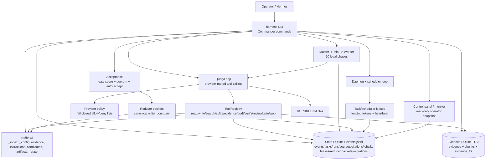
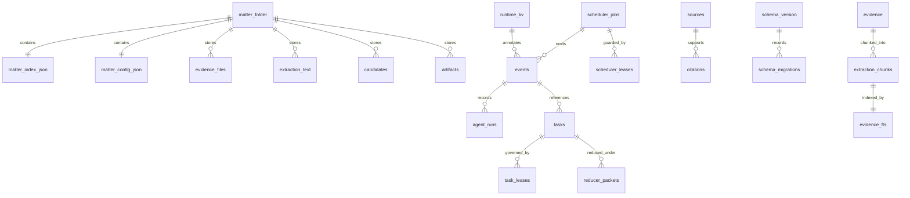
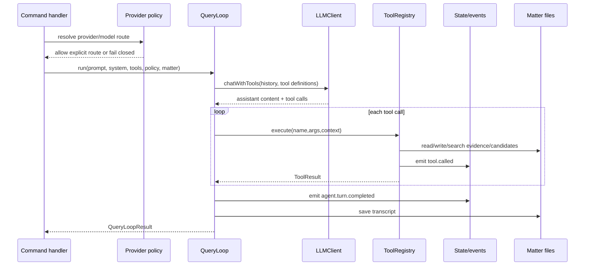
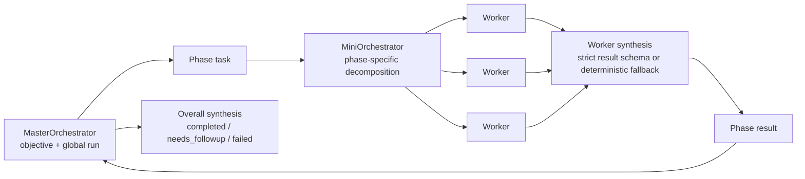
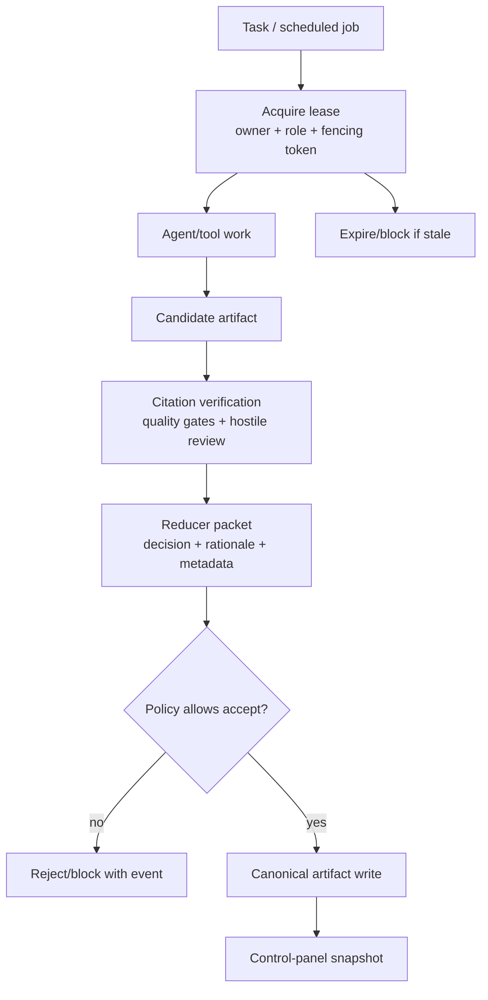
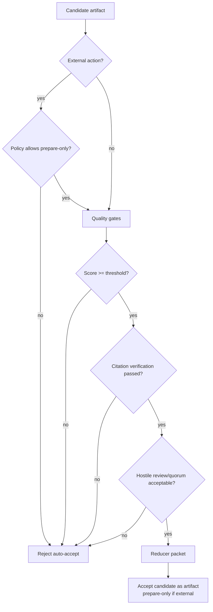

# Atticus Harness V2 Architecture Research Paper

**Date:** 2026-05-06  
**Repository under update:** `atticus-harness-v2`  
**Reference codebase analysed:** `/home/alba/atticus-harness-v2` — TypeScript/Node CLI package `harness-v2`.

---

## Abstract

Atticus Harness V2 is a terminal-native TypeScript legal agent CLI. It optimises for operator ergonomics and agent execution: matter-scoped filesystem state, SQLite/JSONL audit trails, FTS5 evidence search, provider-routed tool-calling loops, provider-native reasoning controls, hierarchical master/mini/worker orchestration, source snapshotting, citation verification, quality gates, review quorum, daemon scheduling, and bundled legal skills.

The current V2 architecture now also ports key governance invariants from the earlier control-plane design: reducer packets, task leases with fencing tokens, fail-closed provider policy semantics, explicit state migration registries, and read-only operator control-panel/monitor commands. The centre of gravity remains the CLI-driven agent runtime and matter workspace, but safety-critical transitions are increasingly represented in durable state rather than implicit TypeScript control flow alone.

---

## 1. Research methodology

This paper is based on static source inspection of the V2 codebase, with emphasis on architecture-significant files.

| Topic | V2 evidence |
| --- | --- |
| Runtime/package | `package.json`, `src/cli.ts` |
| Durable model | `src/state/schema.ts`, `src/state/store.ts`, `src/storage/sqlite/schema.ts` |
| Governance upgrades | `src/state/leases.ts`, `src/state/reducer-packets.ts`, `src/state/migrations.ts`, `src/config/provider-policy.ts`, `src/commands/control-panel.ts` |
| Agent/orchestration | `src/agent/query-loop.ts`, `src/orchestration/*` |
| Evidence/research | `src/extraction/*`, `src/storage/sqlite/*`, `src/research/*` |
| Safety/gates | `src/acceptance/*`, `src/citation/verify.ts`, `src/config/*` |
| Operator surface | `README.md`, `docs/hermes-agent-guide.md`, `src/commands/*` |

| Metric | V2 |
| --- | ---: |
| Primary language | TypeScript / Node 18+ |
| Top-level implementation modules | 18 TypeScript source areas under `src/` |
| Durable schema tables observed | 8 matter-state tables + 4 evidence-index tables, with governance migration additions |
| CLI command registrations observed | 55 Commander command/new-command registrations |
| Unit/integration tests observed | 21 Vitest files |
| Skills library | 915 bundled legal/writing skills |

---

## 2. Architectural thesis

V2 is a legal agent product shell. It assumes the operator will run a coherent terminal CLI around matter folders, agent loops, tool registries, evidence search, source fetches, schedules, daemon control, and candidate acceptance.

The latest governance work moves V2 from a purely product-centred shell toward a governed agent runtime:

1. **Candidate material remains separate from accepted artifacts.** Reducer packets now make the candidate-to-artifact decision explicit and auditable.
2. **Background work is lease-governed.** Task and scheduler leases carry owners, expiries, heartbeats, roles, and fencing tokens.
3. **Provider routing fails closed by default.** Provider/model use must match explicit policy; denied, fallback, free, held, or unknown routes are rejected unless configured.
4. **Schema evolution is registered.** State migrations are explicit, versioned, and idempotent.
5. **Operator supervision is a first-class CLI surface.** `control-panel`, `panel`, and `monitor` commands expose read-only matter snapshots and handoff packets.

---

## 3. Architecture

### 3.1 V2 system context

V2 is a Node/TypeScript CLI named `harness`. It runs as a standalone legal operations agent with evidence ingestion, hierarchical orchestration, drafting, citation verification, source snapshots, schedules, daemon control, configurable autonomy, and governance state.

### 3.2 Module decomposition

| V2 module area | Architectural responsibility |
| --- | --- |
| `src/cli.ts`, `src/commands/` | Commander CLI entry point and lazily-loaded command handlers for matter lifecycle, agent loops, evidence, acceptance, config, orchestration, sources, schedules, daemon, case management, and operator control panel. |
| `src/storage/matter.ts`, `src/storage/*` | Matter workspace CRUD and artifact/candidate/evidence storage. Creates per-matter directories and `_index.json` / `_config.json`. |
| `src/state/*` | Matter state database and JSONL audit events: events, tasks, task leases, reducer packets, agent runs, sources, citations, scheduler jobs, runtime key-values, schema versions, and migration registry. |
| `src/state/leases.ts`, `src/scheduler/store.ts` | Lease acquisition, heartbeat, completion, blocking, expiration, scheduler job leasing, and fencing-token updates. |
| `src/state/reducer-packets.ts`, `src/reducer/canonical-writer.ts` | Explicit reducer decisions between candidate artifacts and accepted canonical artifacts. |
| `src/storage/sqlite/*` | Evidence index with `evidence`, `extraction_chunks`, and FTS5 `evidence_fts` triggers. |
| `src/extraction/*` | Format detection, hashing, PDF/DOCX/DOC/image/text extraction and normalization. |
| `src/agent/*` | System prompt assembly, structured result parsing, transcript recording, QueryLoop over provider-routed tool calls. |
| `src/tools/*`, `src/research/*` | Policy-aware agent tools plus web search/fetch/source normalization/ranking/snapshot storage. |
| `src/orchestration/*`, `src/legal/*` | Master/mini/worker orchestration over a 10-phase legal workflow and legal artifact taxonomy. |
| `src/acceptance/*`, `src/citation/verify.ts` | Quality gate scoring, review quorum, auto-acceptance rules, citation verification. |
| `src/config/*`, `src/llm/*` | Global/matter config, secrets, autonomy policy, fail-closed provider policy, provider clients, provider-native reasoning translation, token counting. |
| `src/scheduler/*`, `src/daemon/*` | Cron parsing, scheduled job store/loop, daemon PID/status, background supervisor and control queue. |
| `src/commands/control-panel.ts`, `src/state/snapshot.ts` | Read-only control-panel/monitor snapshot and agent handoff packet. |
| `src/tui/*` | Early Ink components for progress display; the mature operator surface is still CLI-first. |
| `src/skills/*` and `skills/` | SKILL.md parsing/loading/selection with a large bundled legal skill corpus. |

### 3.3 V2 data architecture

V2 splits persistent state into three layers:

1. **Matter filesystem:** human-inspectable directories and JSON for matter index/config, evidence blobs, extractions, candidates, artifacts, state logs.
2. **Matter state SQLite:** a compact operational ledger for events, tasks, fenced task leases, reducer packets, runs, sources, citations, scheduler jobs, runtime key-values, schema version, and schema migrations.
3. **Evidence SQLite:** searchable full-text index over evidence records and extraction chunks.

The filesystem remains transparent to an operator, while governance-sensitive transitions are represented in SQLite and events. This hybrid model keeps V2 easy to inspect while avoiding silent state changes around leases, reducer decisions, provider selection, and migration history.

### 3.4 V2 agent/tool execution

The `QueryLoop` controls the core agent cycle:

1. construct a system/user message history;
2. resolve provider/model configuration through fail-closed provider policy;
3. call the resolved `LLMClient.chatWithTools` with registered tool definitions;
4. execute requested tools through `ToolRegistry`;
5. append tool results into the message history;
6. emit `agent.turn.completed` and `tool.called` events;
7. save transcripts under matter candidates.

### 3.5 V2 hierarchical orchestration

The orchestrator expresses legal work as a 10-phase pipeline:

1. intake and normalization;
2. evidence ingestion and fact extraction;
3. issue spotting;
4. law and policy research;
5. merits and risk analysis;
6. procedural route planning;
7. document production;
8. verification and hostile review;
9. bundle and war-room assembly;
10. operator handoff.

`OrchestrationRuntime` enforces maximum depth, maximum concurrency, abort state, and optional budget limits. Worker synthesis converts transcripts into a strict structured result, falling back deterministically if LLM synthesis fails.

### 3.6 Governance lifecycle

The current safety path is explicit:

Key governance components:

- **Reducer packets:** `reducer_packets` persist candidate decisions, status, timestamps, lease links, and metadata before canonical writing.
- **Task leases:** task records carry lease IDs, owners, roles, fencing tokens, acquired/heartbeat/expiry timestamps, and blocked reasons.
- **Fenced scheduler leases:** scheduled jobs use lease IDs and incrementing fencing tokens to prevent stale background workers from completing newer work.
- **Provider policy fail-closed semantics:** `ProviderPolicy` defaults to `failClosed: true`, `allowFallback: false`, and `requireExplicitModel: true`; configured allow/deny lists reject unknown, denied, fallback, free, or reserved routes.
- **Migration registry:** `STATE_MIGRATIONS` and schema migration records make state evolution explicit and idempotent.
- **Control-panel/monitor command:** `harness control-panel status`, `harness panel status`, `harness control-panel agent-packet`, and `harness monitor` expose read-only matter supervision.

### 3.7 V2 autonomy and acceptance

V2 externalizes safety into configuration:

- autonomy modes: `operator_safe`, `auto_internal`, `auto_accept_gated`, `full_local_autonomy`, `custom`;
- external action modes: disabled, prepare-only, prepare-bundle-only, or operator-required-to-send;
- per-tool category policy: read-only, matter-write, network, external-action, agent-spawn, config-change;
- auto-accept conditions: gate score, citation verification, hostile review, review quorum, external-action checks;
- provider route conditions: explicit provider, explicit model, allow-list membership, deny-list exclusion, and no silent fallback by default.

### 3.8 V2 strengths

1. **Clean operator UX.** The `harness` CLI is coherent and grouped around real operator tasks.
2. **Simple matter layout.** Per-matter directories are easy to inspect, back up, and reason about.
3. **Modern agent loop.** The TypeScript provider-routed tool-calling loop is direct, testable, and extensible.
4. **Integrated legal workflow.** The 10-phase workflow gives the orchestrator a domain-specific backbone.
5. **Large skill corpus.** The bundled skills turn the harness into a practical legal drafting/review environment.
6. **Daemon and scheduler support.** V2 can run asynchronously while still exposing status/events.
7. **Dual audit path.** SQLite plus JSONL events balance queryability and human-readable logs.
8. **Governance state.** Reducer packets, fenced leases, fail-closed provider policy, migration records, and monitor snapshots make safety boundaries more inspectable.

### 3.9 V2 trade-offs

1. **Hybrid state still requires discipline.** Filesystem state, SQLite rows, and JSONL events must remain aligned.
2. **Governance is newer than the agent shell.** Reducer packets, leases, and monitor commands need continued test coverage as new commands are added.
3. **TUI is still early.** V2 has Ink progress components and CLI monitor/control-panel commands, but not a full curses or web console.
4. **Legal graph normalization remains compact.** V2 keeps fewer relational source/artifact/citation tables than a full control-plane ledger.

---

## 4. Current status

As of this analysis, V2 is a functional TypeScript CLI codebase with:

- matter initialization, status, events, inbox, watch, monitor, and case-management commands;
- read-only `control-panel` / `panel` operator snapshots and agent handoff packets;
- evidence ingestion, extraction, SQLite FTS5 indexing, and evidence search;
- Provider-backed agent query loop with policy-aware tools;
- fail-closed provider policy defaults for explicit provider/model routing;
- source search/fetch/snapshot storage for research;
- hierarchical master/mini/worker orchestration across 10 phases;
- draft, citation verification, hostile review, quality gate, reject, manual accept, and auto-accept flows;
- reducer packets for candidate-to-artifact governance;
- task and scheduler leases with fencing tokens, heartbeat/expiry tracking, and blocked reasons;
- state migration registry and schema migration records;
- global and matter-level configuration/secrets/autonomy policy;
- cron scheduler and daemon controls;
- 915 bundled legal/writing skills;
- Vitest coverage for acceptance, citation verification, daemon, extraction, legal workflow, LLM config/errors, matter state/storage, orchestration, policy, query loop, research, scheduler, skills parser, token counting, and worker synthesis.

---

## 5. Conclusion

V2 is operator-friendly, agent-native, and easier to evolve as a terminal product. The latest governance upgrades strengthen its legal-safety posture by making critical lifecycle boundaries explicit in state: work is leased, provider routes are fail-closed, candidate acceptance is mediated by reducer packets, migrations are registered, and operators have monitor/control-panel snapshots.

The governing principle is unchanged: **legal model output is not legal truth until it is traced to evidence, validated, reviewed, reduced, and accepted under operator-safe policy.** V2 now expresses more of that principle directly in its TypeScript CLI and matter-state ledger.

---

## Appendix A: Glossary

- **Candidate artifact:** A draft/model-produced output that is not yet canonical.
- **Canonical artifact:** An accepted matter artifact that passed policy and review boundaries.
- **Reducer packet:** A persisted decision record that accepts, rejects, or documents the conversion of a candidate toward a canonical artifact.
- **Reducer:** A safety layer that converts or rejects candidate packets before canonical writing.
- **Task lease:** A durable claim on task execution with owner, expiry, heartbeat, role, and fencing metadata.
- **Fencing token:** A monotonically increasing token used to reject stale lease holders.
- **Matter:** A legal case/workspace with scoped evidence, state, events, and artifacts.
- **Prepare-only external action:** A letter/form/filing/email candidate prepared for operator review but not sent, filed, served, paid, or otherwise externally executed by the harness.
- **Source snapshot:** Stored copy/hash/text of a source used to make verification reproducible.
